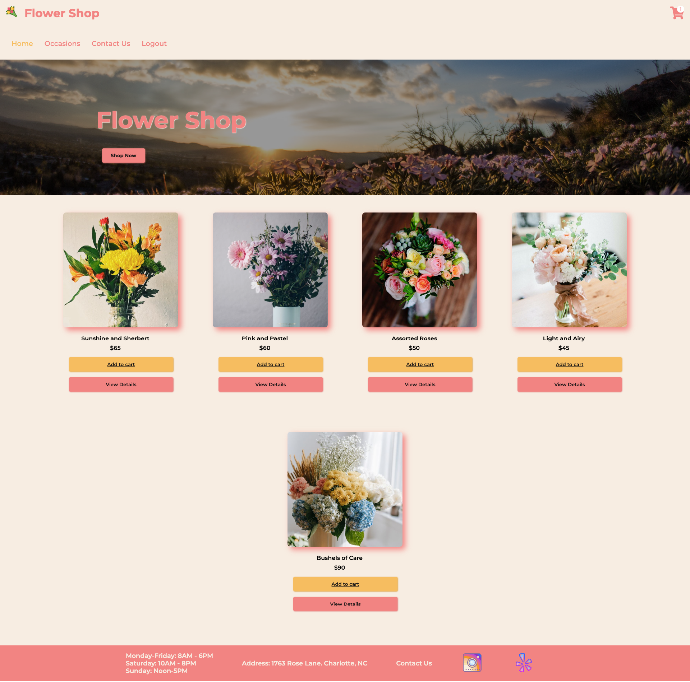
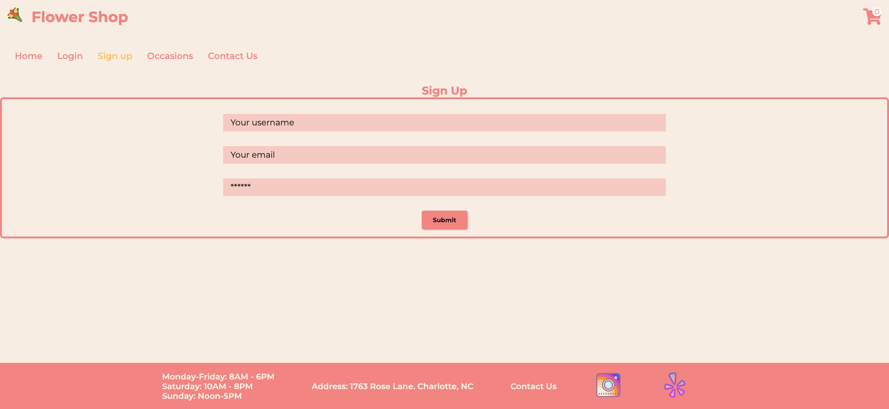
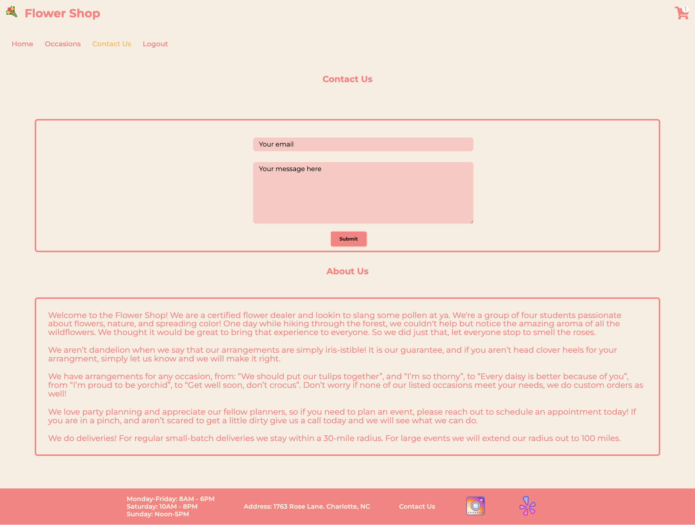
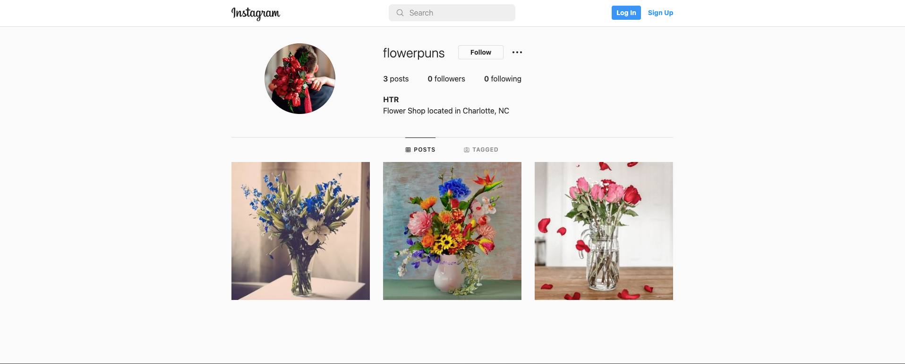

# Flower Shop

[LIVE SITE](https://bouquetnow.herokuapp.com/)

[REPOSITORY](https://github.com/ntraugh/flower-shop)

## TABLE OF CONTENTS

1. [Description](#description)
2. [Usage](#USAGE)
3. [Visuals](#visuals)
4. [Authors Acknowledgments](#authors-and-acknowledgments)
5. [Resources](#resources)

## DESCRIPTION

The Flower Shop is an ecommerce website for a flower shop. This shop will sell bouquets and arrangements by occasion: Birthday, Anniversary, Congratulations, Get Well Soon, Love & Romance and Thank You. Users can make accounts when purchasing their arrangements, edit their carts, purchase the items in their carts, and log back into their accounts when they revisit the site.

We will incorporate the Stripe payment platform for our shopping cart, and IndexDB to store the cart information. Footer displays hours, location, a way to contact us and some social media platforms. The location, contact us and social icons are working links. Custom Arrangements and arrangements for larger occasions (weddings, funerals, proms) are optional inclusions to the website if we have time.

For this site we utilized: React, Concurrently, Stripe payment platform, Apollo, Express, GraphQl, Jsonwebtoken (JWT), Formspree, MongoDb, Mongoose, Compass, Bcrypt and Nodemon.

## USAGE
Upon arriving to the shop's webpage, you will start at our homepage, where you will see our logo, a shop now button, a navigation bar, featured items, and your cart. To speed up the checkout process, create yourself an account that will be remembered for next time. Once logged in, if you are looking for a specific occasion, click that link in the Nav and you will land on our occasions page with the following choices: Anniversary, Birthday, Congratulations, Get Well, Love and Romance, and a Thank You. Selecting any of those will take you to items with that specific style in mind. Once in an occasion page, you will have the ability to view products, add directly to cart, or view more details on that item. If you decide to add to cart, it will show in the top right corner. Click the cart to start the checkout process. 

If you want to reach out for more information, please click the Contact Us link in the Navigation or in the footer. When reaching out, please make sure you enter your valid email address and keep your inquiry to under 500 characters. The page will prompt you upon successful submission. Please give us 24 hours to respond. 

If you love us, make sure you follow us on Instagram @flowerpuns and leave us an awesome review on yelp! 

Before leaving our site, please make sure you log out! 

## Authors and Acknowledgements
Mary Cancellieri | Lacy Nunally | Hans Reichgelt | NateTraugh

## VISUALS

## RESOURCES

1. [LIVE SITE](https://bouquetnow.herokuapp.com/)

2. [REPOSITORY](https://github.com/ntraugh/flower-shop)